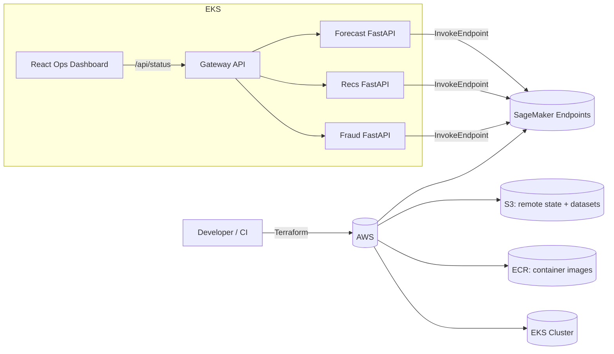

# Internal ML Platform — EKS + SageMaker + CI/CD (Assessment IV)

This repository is a **platform engineering** deliverable that supports **three internal business units** (Fraud / Recommendations / Forecasting).
Each team owns a SageMaker endpoint and a FastAPI service, while the platform team provides:
- Repeatable infrastructure with Terraform
- Kubernetes orchestration on EKS with namespace separation, quotas, probes, and config hygiene
- CI/CD with GitHub Actions (build → push → deploy)
- A unified **Gateway API** and a lightweight **React Ops Dashboard**

## Business Scenario
You support 3 internal teams:
- **Fraud Detection Team** — XGBoost classifier (fraud vs legit)
- **Recommendations Team** — Factorization Machines (ranking/ratings)
- **Forecasting Team** — DeepAR-style time series forecasting

Datasets used:
- IEEE-CIS Fraud Detection (Kaggle competition): https://www.kaggle.com/competitions/ieee-fraud-detection
- MovieLens (100k/1m/25m): https://grouplens.org/datasets/movielens/
- ElectricityLoadDiagrams20112014 (UCI): https://archive.ics.uci.edu/dataset/321/electricityloaddiagrams20112014

> Notes on dataset sources:
> - MovieLens download links are served from `files.grouplens.org` (see GroupLens dataset pages).
> - UCI provides a downloadable zip for ElectricityLoadDiagrams20112014.
> - Kaggle datasets require Kaggle API credentials.

---

## Architecture (high-level)



---

## Prerequisites

### Local tools
- **AWS CLI v2** (configured with a profile or env vars)
- **Terraform** >= 1.6
- **kubectl** >= 1.28
- **Docker**
- **Python** 3.10+ (3.11 recommended)
- **Node.js** 18+ (for dashboard local dev)

### AWS prerequisites
- An AWS account where you can create:
  - VPC, EKS, IAM, ECR, S3, DynamoDB
- An S3 bucket and DynamoDB table for Terraform remote state (this repo includes a bootstrap module)

### Kaggle prerequisites (for IEEE-CIS download)
- Create Kaggle API token: `~/.kaggle/kaggle.json`
- Or set:
  - `KAGGLE_USERNAME`
  - `KAGGLE_KEY`

### GitHub Actions prerequisites (CI/CD)
- Configure repository **Variables**:
  - `AWS_REGION` (e.g. `us-west-2`)
  - `EKS_CLUSTER_NAME` (e.g. `internal-ml-platform`)
  - `KUSTOMIZE_OVERLAY` (e.g. `dev`)
- Configure repository **Secrets** (no OIDC, assume-role for CI):
- `AWS_ACCESS_KEY_ID` and `AWS_SECRET_ACCESS_KEY` (bootstrap IAM user keys)
- `AWS_DEPLOY_ROLE_ARN` (Terraform output `github_deploy_role_arn`)
- `POD_AWS_ACCESS_KEY_ID` and `POD_AWS_SECRET_ACCESS_KEY` (SageMaker invoke IAM user keys for pods)
- Optional: `POD_AWS_SESSION_TOKEN`
- `ECR_REGISTRY` and `ECR_REPO_*` (from Terraform outputs)

---

## Repository Structure

```
.
├── terraform/
│   ├── bootstrap/                # creates S3+DDB for remote state
│   └── platform/                 # EKS, ECR, IAM (IRSA), dataset bucket
├── k8s/
│   ├── base/                     # namespaces, quotas, services, deployments
│   └── overlays/
│       └── dev/                  # environment overlay (kustomize)
├── services/
│   ├── common/                   # shared SageMaker invoke helper
│   ├── fraud_service/
│   ├── recs_service/
│   ├── forecast_service/
│   ├── gateway/
│   └── dashboard/                # React ops UI (Vite)
├── scripts/
│   ├── upload_datasets_to_s3.py
│   ├── create_mock_sagemaker_endpoints.py
│   ├── setup_kubeconfig.sh
│   ├── port_forward.sh
│   └── ...
└── .github/workflows/
    ├── terraform.yml
    └── deploy.yml
```

---

## Step-by-step: setup → deploy → verify

### 0) Set environment variables
```bash
export AWS_REGION=us-west-2
export TF_VAR_region=$AWS_REGION
export TF_VAR_project_name=ed45-ml-platform
export TF_VAR_cluster_name=ed45-ml-platform
```

### 1) Bootstrap Terraform remote state (one time)
```bash
cd terraform/bootstrap
terraform init
terraform validate
terraform plan
terraform apply
```

This creates:
- S3 bucket for TF state
- DynamoDB table for state locking

### 2) Provision platform infrastructure (EKS/ECR/IAM/S3)
Create `terraform.tfvars` in `terraform/platform` with:

```terrafrom.tfvars
region=<AWS_REGION>
project_name=<TF_VAR_project_name>
cluster_name=<TF_VAR_cluster_name>
```
Provision the infrastructure with the following commands:

```bash
cd ../platform
terraform init
terraform validate
terraform plan
terraform apply
```

Outputs include:
- Cluster name
- Dataset bucket
- ECR repo URLs
- GitHub Actions deploy role ARN
- GIthub Action User role ARN
- SageMaker execution role ARN
- SageMaker invoke role ARN


### 3) Configure kubectl for the cluster
```bash
./scripts/setup_kubeconfig.sh <cluster-name> <region>
kubectl get nodes
```

### 4) (Optional) Upload datasets to S3 (raw layer)
```bash
python3 scripts/upload_datasets_to_s3.py \
  --bucket <dataset-bucket> \
  --prefix datasets/raw \
  --movielens 100k \
  --download-uci
```

### 5) Create **mock** SageMaker endpoints (for a working demo)
You can later replace these with real models.
```bash
python3 scripts/create_mock_sagemaker_endpoints.py \
  --region <region> \
  --prefix internal-ml-platform \
  --role-arn <sagemaker-execution-role-arn>
```

### 6) Deploy Kubernetes workloads (kustomize)
```bash
kubectl apply -k k8s/overlays/dev
kubectl -n platform get pods
```

### 7) Verify from your laptop (port-forward)
```bash
./scripts/port_forward.sh
# Gateway: http://localhost:8080
# Dashboard: http://localhost:3000
```

Check:
- `GET http://localhost:8080/status`
- `POST http://localhost:8080/predict/fraud`
- `POST http://localhost:8080/predict/recs`
- `POST http://localhost:8080/predict/forecast`

### 8) Teardown
```bash
kubectl delete -k k8s/overlays/dev || true
cd terraform/platform && terraform destroy
cd ../bootstrap && terraform destroy
```

---

## Deployment via GitHub Actions (recommended path)
1. Run workflow **Terraform (manual)** → provisions infra & OIDC deploy role.
2. Run workflow **Build & Deploy** → builds images, pushes to ECR, deploys to EKS, runs rollout checks.

---

## Notes / Design Choices
- **No OIDC**: Pods use **Kubernetes Secrets** for AWS credentials (restricted environment).
- **Namespace isolation** per team + platform namespace.
- **ConfigMaps** for endpoint names, timeouts, and log levels; **Secrets** only for non-AWS sensitive items (e.g., optional registry tokens).
- Readiness/liveness/startup probes demonstrate controlled restart behavior and gated traffic.


## Real Model Path
See `scripts/REAL_MODEL_PATH.md` and use `scripts/train_all_real_models.py`.


## Kubernetes AWS credentials (no IRSA)
- CI/CD uses GitHub Secrets to create `aws-credentials` Secret per namespace automatically.
- For local deploys, run: `./scripts/create_k8s_secrets_from_env.sh` after exporting AWS_ACCESS_KEY_ID/AWS_SECRET_ACCESS_KEY.

### Optional (Terraform via GitHub Actions)
If you want the `terraform.yml` workflow to run in CI, set `AWS_TERRAFORM_ROLE_ARN` to a role that can provision infrastructure. Otherwise, run Terraform locally.
